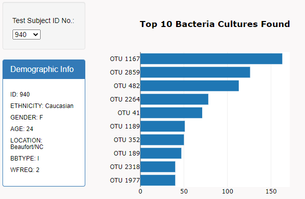
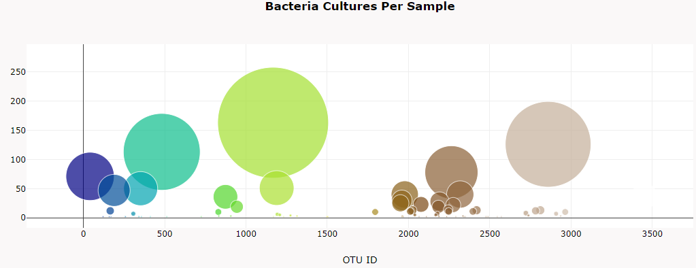
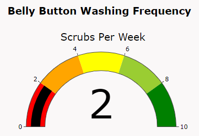

# Plotly & Belly Button Biodiversity

## Overview of the analysis
A biological researcher, Rosa, will be assisted in completing a dashboard that both the research participants and fellow researchers can access. Volunteers who participated in the study will be able to visit the website and select their ID numbers to see the top 10 bacterial species in their belly buttons.  

The four technical analysis deliverables required to complete Plotly belly button biodiversity analysis include  

1. Create a Horizontal Bar Chart
2. Create a Bubble Chart
3. Create a Gauge Chart
4. Customize the Dashboard

## Resources
- Data Source: This analysis was performed using the [samples.json](https://github.com/aobasuyi/Plotly_Biodiversity/blob/main/static/js/samples.json) dataset.
-  Code: [index.html](https://github.com/aobasuyi/Plotly_Biodiversity/blob/main/index.html).
- Software: ES6, Javascript;  Visual Studio Code, 1.56

## Results
  

**Horizontal Bar Chart**  
- JavaScript, Plotly, and D3.js, was used to create a horizontal bar chart to display the top 10 bacterial species (OTUs) when an individual’s ID is selected from the dropdown menu on the webpage.

    

**Bubble Chart**  
 JavaScript, Plotly, and D3.js, was used to create a corresponding bubble chart that will display the following when an individual’s ID is selected from the dropdown menu webpage (as shown below)

    

**Gauge Chart**  
JavaScript, Plotly, and D3.js, was used to create a gauge chart that displays the weekly washing frequency's value, and display the value as a measure from 0-10 on the progress bar in the gauge chart when an individual ID is selected from the dropdown menu.

    

**Customize the Dashboard**  
When the dashboard is first opened in a browser, ID 940’s data is displayed in the dashboard, and all three charts are working according to the requirements when a sample is selected from the dropdown menu. 

HTML and Bootstrap to customize the webpage for your dashboard by adding the following: 
- An image was added to the jumbotron.
- The background color was updated to be compatible to the webpage.
- A custom color added to contrast the colour of the font.

  

**The Plotly Belly_Button dynamic dashboard can be via the GitHub Pages (shown below) **
 

  

**[Belly Button Biodiversity Dashboard](https://aobasuyi.github.io/Plotly_Biodiversity/)**

 

or

  

https://aobasuyi.github.io/Plotly_Biodiversity/

